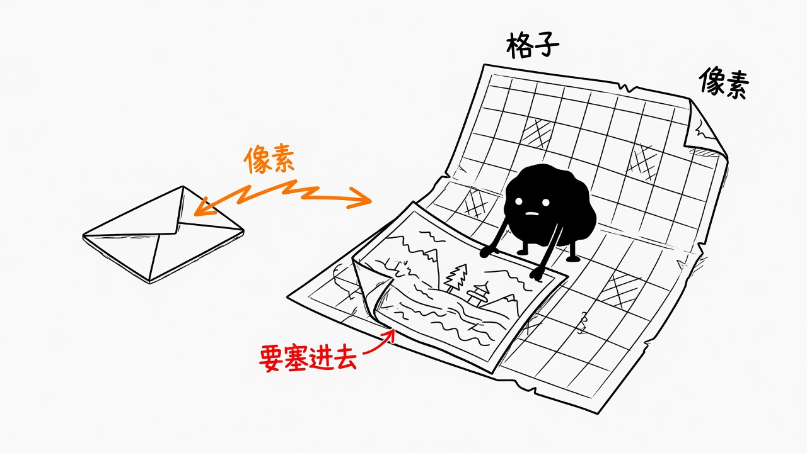
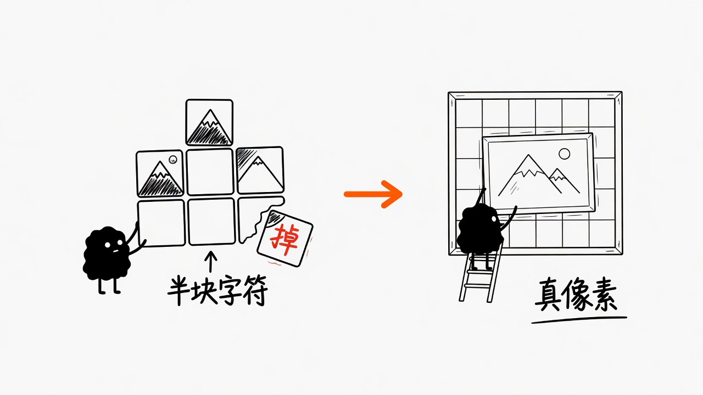
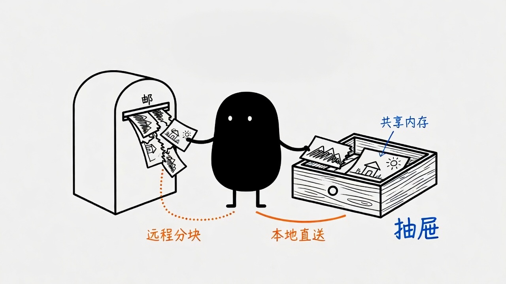
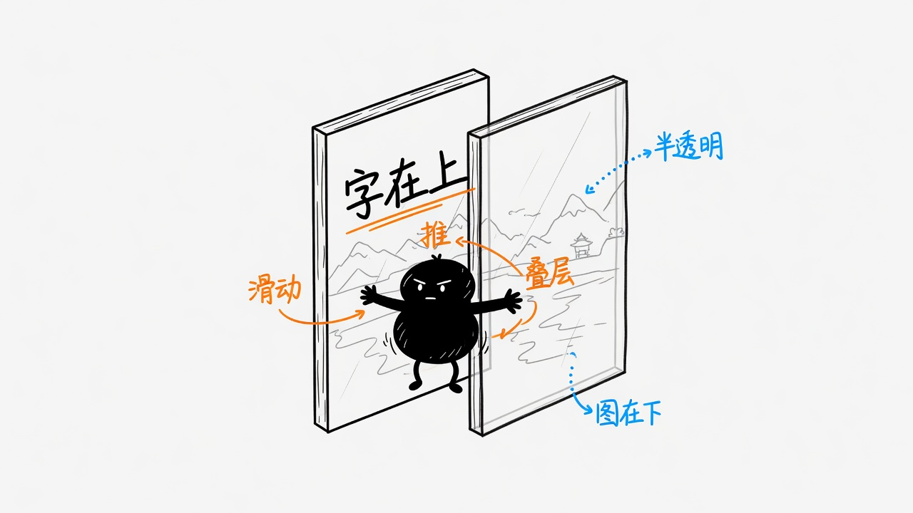
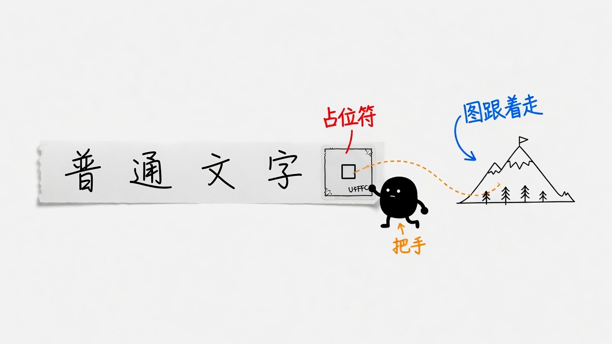

# Kitty Graphics：把像素塞进字符格子

终端默认只认识字符。你 `cat` 一张 png，得到的是乱码，或者被半块字符糊成的马赛克。2017 年，Kitty 终端的作者 Kovid Goyal 写了一套协议：跑在终端里的程序把像素数据发给模拟器，由模拟器自己画到屏幕上。官方名字是 Terminal Graphics Protocol，大家口头都叫 Kitty Graphics。

终端是一张字符网格，每个格子只能放一个字符、一种前景色、一种背景色。图是连续像素，尺度和格子对不上。协议做的就是让真图像进这张网格，并且还能和文字一起滚、一起叠、一起被删。



图要比格子大。协议允许按像素定位，也允许按行、列缩放，溢出的部分会被裁掉。程序不用自己把图切成字符。

## 旧办法为什么不够用

在这套协议出现之前，终端里看图大概只有三条路。

半块字符、Braille、色块，是把图量化成字符。远看像图，近看是马赛克。分辨率被格子锁死，透明和抗锯齿基本没有，动画更吃力。

Sixel 更老，来自 1980 年代的 DEC VT240。它能画像素，支持面也比 Kitty Graphics 广。代价是原始：图写进单元格之后，再往那个坐标打字，图就会缺一块；每一帧都要编码后从 tty 里挤过去，本地播视频会明显慢一截。

iTerm2 有自己的 `OSC 1337;File=` 内嵌图协议。能力窄，主要是「在光标处贴一张图」，厂商私有，别的终端跟不跟得上全看心情。

Kitty Graphics 把「传图」和「摆图」拆开。程序先把像素存进终端，给这张图一个 id，再在某个光标位置创建一个 placement。同一张图可以摆多次，可以只显示其中一块，可以拉成若干行若干列，可以指定 z-index，让图在文字上面或下面，半透明还能叠在一起。



半块字符是把图变成字。Kitty Graphics 是把图当成独立对象，挂在网格上。

## 怎么把像素送进终端

所有图形命令都长一个样子：

```text
ESC_G<控制项>;<payload>ESC\
```

这是 APC（Application Programming Command）。多数传统终端会直接忽略 APC，所以乱发也不容易把别人的屏幕打烂。payload 一律先做 base64，避免二进制里的控制字符把老终端搞懵。

终端必须懂三种像素格式：24-bit RGB、32-bit RGBA、PNG。协议故意不要求终端去实现 JPEG、WebP、AVIF。解码格式是客户端的事，终端只收已经解开、或至少很好解的数据。PNG 留着，是因为它方便，也能比较紧凑地传调色板图。

传输介质分本地和远程。

本地可以走普通文件、临时文件，或共享内存。终端直接读，不必把整张图塞进转义序列。共享内存这条路径是 `mpv --vo=kitty` 能在终端里播视频的关键：帧差走 shm，tty 上只剩很短的控制命令。

远程，比如 SSH 过去，文件系统和共享内存都碰不到。数据只能切块，每块不超过 4096 字节，用 `m=1` / `m=0` 标记还有没有下一块。整张图收齐、校验完，终端才画。光标位置以最后一块到达时为准。



同一张图，远程只能撕开走转义序列；本地可以整张交给终端。客户端事先不知道自己跟终端是不是同一台机器，协议为此留了查询：带上图像 id 发一次，终端回 `OK` 或错误。也可以发 `a=q` 做纯查询，试完不存图。要判断当前终端支不支持这套协议，标准做法是先发查询，紧跟着发一条 DA1（`ESC[c`）。只回了设备属性、没回图形查询，就是不支持。

## 图和字怎么待在同一张网格里

传完只是入库。要让人看见，还得创建一个 placement。

默认从当前光标所在单元格的左上角开始画，可以用 `X` / `Y` 在格子里再偏几个像素。可以用 `x,y,w,h` 指定源图的哪一块，用 `c,r` 指定占几列几行。z-index 决定前后：正值盖在字上，负值钻到字下面，再负一截会钻到非默认背景色下面。半透明图按 z-index 混合。



图不是盖住整屏的海报。它可以在字下面当底，也可以盖在字上面当浮层。放完之后，光标默认会按这张图占的行列往右、往下走；程序也可以要求光标别动。

删除同样是一等公民。可以按 id 删，按光标所在格子删，按某一列、某一行、某个 z-index 删。小写只拿掉屏幕上的 placement，大写连像素数据一起丢掉，前提是滚动缓冲区里没有别人还在引用。终端还要有配额，Kitty 自己是每个 buffer 320MB，免得有人往里灌图做拒绝服务。

0.20 之后协议加了动画：先有一张底图，再往上加帧。帧可以只传一块脏矩形，其余部分沿用上一帧，也可以指定每帧间隔，让终端自己循环播。客户端不用一直挂着，也不必把整屏重新挤过 tty。

## 占位符：不懂图的程序也能搬图

协议后来补了一招，对 TUI 生态影响最大。

从 Kitty 0.28 起，可以用私用区字符 `U+10EEEE` 当占位符。图先静默传给终端，不创建可见 placement，只留一个虚拟原型。然后让宿主程序，比如 tmux、Vim、WeeChat，输出这个字符，再用组合变音符号标出行、列，用前景色编码图像 id。宿主只把它当普通 Unicode 文本搬来搬去。终端看见占位符，就知道该把哪张图贴在那个格子上。



占位符是把手。tmux 和 Vim 不用实现图形协议，图却能跟着文本重排、滚动、被复制。0.31 又加了相对 placement：一张透明的一像素图用占位符钉在文本流里，真正的图相对它定位。文本一动，整组图跟着动。

历史上最大的断点是多路复用器。图从终端协议里走，tmux 坐在中间却不认识这些序列，图就会丢，或者错位。占位符把图重新绑回普通字符这条所有人都会处理的路径上。没有这一步，文件管理器预览、编辑器里贴图，在 tmux 里都会瘸。

## 为什么终端现在逃不掉

工具已经按这套协议写了。

文件管理器里，Yazi、ranger、broot 用它做图片预览。编辑器里，Neovim 的 `image.nvim`、`hologram.nvim` 用它在 buffer 里画图。媒体这边，`mpv --vo=kitty`、timg、chafa、viu 都能走这条路径。fzf、kitty-diff、终端 PDF 阅读器，甚至 Chromium 内核的终端浏览器 awrit，也在用。

终端不再只是打字机。看图、看视频、在编辑器里贴截图、在文件管理器里扫缩略图，都变成这个终端做不做的问题。不做，这些工具就会退化成马赛克，或者直接报错。

Alacritty 至今不支持任何图形协议，用户量仍然很大，「不支持图」能活。但新终端如果还缺这一块，会和正在长起来的 TUI 生态对不上。截至 2026 年 8 月，官方列出已经实现或在实现这套协议的终端包括 Kitty、Ghostty、WezTerm、Konsole、Warp、iTerm2、xterm.js、wayst，以及打了补丁的 st。完整度差得很远。Unicode 占位符、动画、共享内存这些进阶能力，各家参差。

协议解析本身是中等工作量：分块 APC、图像仓库、按 id 索引的 placement 列表，可以在无头环境里对着官方测试图测。难的是渲染。图必须和单元格交错画，背景、选区、图、字、光标的 z-order 要对；placement 锚定的是位置，不是格子，滚动和 resize 之后的回流都要单独处理。很多终端选择先把文字路径做稳，再加这一层。

## 自己试一下

Kitty 里最省事：

```sh
kitten icat path/to/image.png
```

最小的 PNG 发送，就是把文件做 base64，切成不超过 4096 字节的块，第一块带 `a=T,f=100`，后续块只带 `m`，最后一块 `m=0`。官方文档里有 POSIX sh 和 Python 的完整例子。

探测支持不要靠 `$TERM`。发一条 `a=q` 查询，再紧跟 DA1。回了图形查询，就是支持。只回了设备属性，就当它不会画。

完整控制项表、动画合成、配额和错误码，以 [Kitty 官方协议](https://sw.kovidgoyal.net/kitty/graphics-protocol/) 为准。
