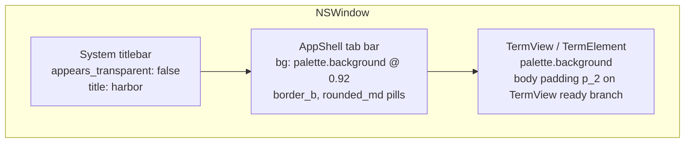
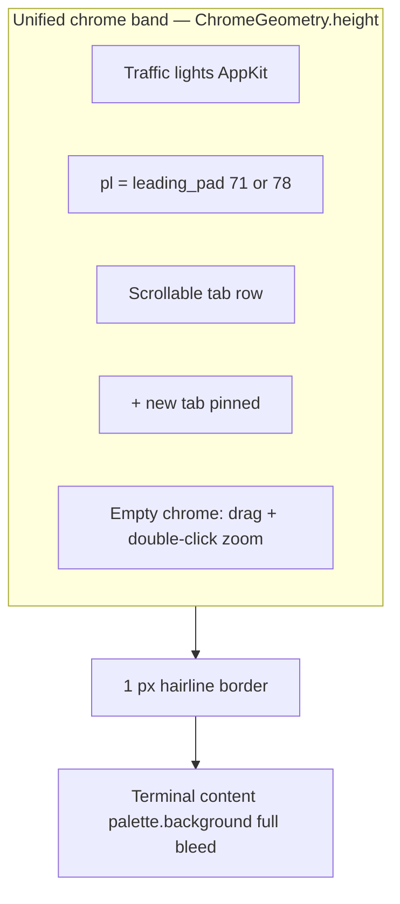
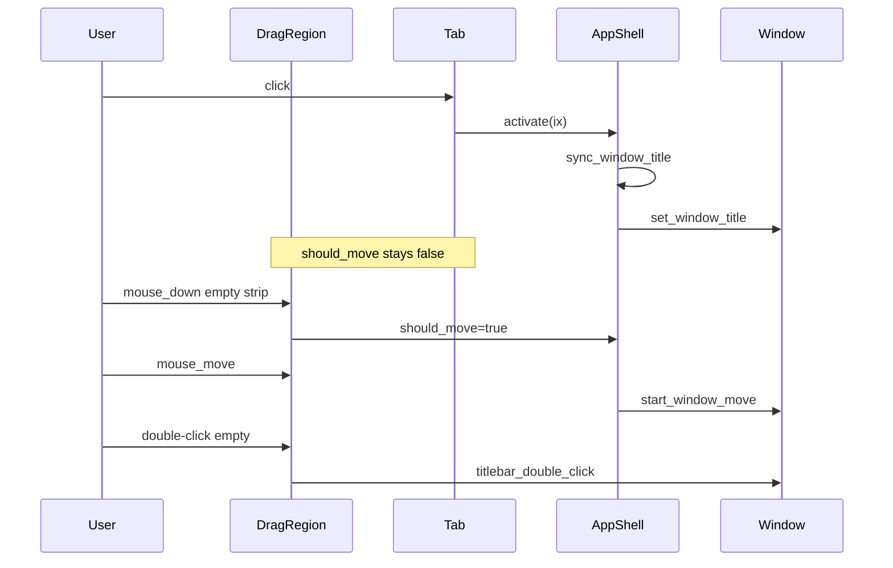
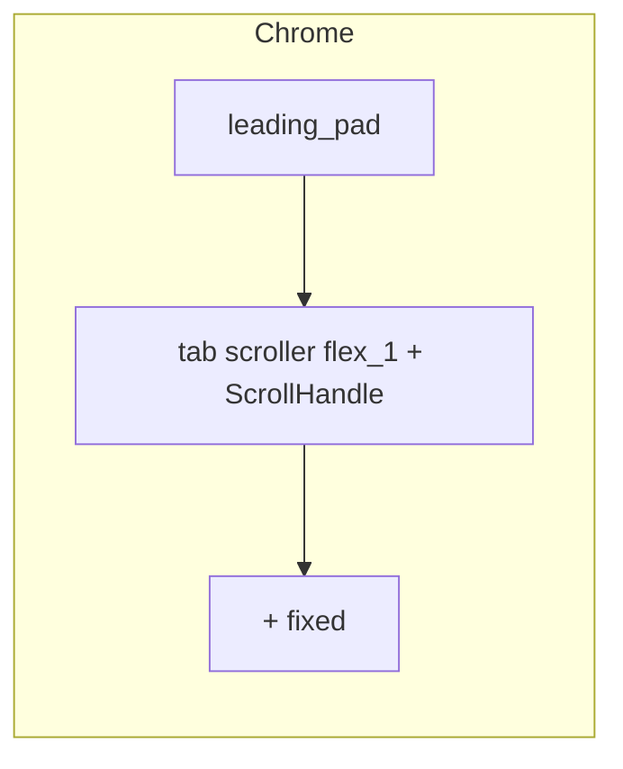
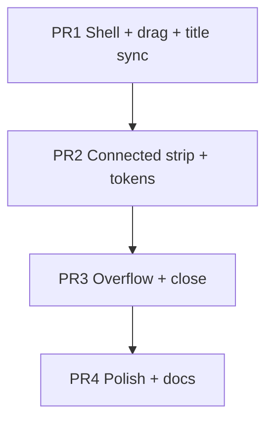

# harbor: macOS HIG-Aligned Window Chrome & Tab UI Redesign

| Field | Value |
|-------|--------|
| **Status** | Implemented (rev 3 design; chrome landed in tree) |
| **Author** | (TBD) |
| **Date** | 2026-08-10 |
| **Product** | harbor (macOS-only terminal emulator) |
| **Scope** | Window chrome, title bar, tab strip, shell layout — not terminal cell painting or themes |
| **Related crates** | `harbor`, `harbor_ui`, `harbor_settings` (optional chrome tokens) |
| **Upstream GPUI pin** | Zed `371a7d4ba2fd0064b79a0bc67d28e57a906779dc` |

---

## Overview

harbor’s current shell stacks a **native macOS title bar** above a **custom, theme-colored pill tab strip**. That produces double chrome: system gray title material, then a floating Catppuccin chip row, then the terminal. The result reads as “Zed-like custom UI bolted under AppKit,” not as Terminal.app / Safari / Finder-style cohesion.

This design unifies window chrome and tabs into a **single custom title-region** using GPUI’s transparent titlebar APIs (already used by Zed, without pulling Zed editor chrome crates). Terminal content themes (Catppuccin mocha/macchiato/frappe/latte) remain; only shell/chrome presentation and hierarchy change. Implementation stays in local crates via a **4-PR** incremental plan.

**Locked visual default:** active tab is **connected to content** (`active_tab_bg == palette.background`); chrome surface is lifted (dark themes) or sunk (latte) relative to content.

---

## Background & Motivation

### Current architecture (as implemented)



| Layer | Source | Behavior today |
|-------|--------|----------------|
| Window open | [`crates/harbor/src/main.rs`](crates/harbor/src/main.rs) | `TitlebarOptions { appears_transparent: false, traffic_light_position: None }` |
| Shell | [`crates/harbor_ui/src/app_shell.rs`](crates/harbor_ui/src/app_shell.rs) | Flex column: tab bar (`px_2`/`py_1`, gap, selection pills) + active `TermView` |
| Tabs | same | Active: `selection.opacity(0.55)`; inactive: bar bg; titles from `TermView::title()` |
| Terminal | [`harbor_ui.rs`](crates/harbor_ui/src/harbor_ui.rs) `TermView::render` + [`term_element.rs`](crates/harbor_ui/src/term_element.rs) | Cell paint via palette; **`p_2` padding is on `TermView` ready branch**, not on `AppShell` chrome |
| Colors | [`harbor_settings` themes](crates/harbor_settings/src/themes.rs) | Full palette for cells; chrome reuses `background` / `selection` / `ansi[8]` ad hoc |

### Pain points (mapped to screenshot / HIG)

1. **Fragmented hierarchy** — Title bar and tab strip are different materials, different densities, no shared vertical rhythm.
2. **Pill tabs as “floating chips”** — `rounded_md` selection on a near-full-opacity bar does not read as macOS tabs (Safari continuous strip, Terminal segmented/system tabs).
3. **Traffic-light / content collision risk** if we only recolor without redesign — Today traffic lights sit in system chrome; after transparent titlebar we must reserve clearance (**71 / 78 px**, Zed baseline) and drag regions explicitly.
4. **Inactive window state ignored** — No dimming of chrome when `!window.is_window_active()`, which macOS users expect. (GPUI refreshes the window on activation changes, so `is_window_active()` in `Render` is sufficient; optional `observe_window_activation` not required.)
5. **Title redundancy** — Window title fixed to `"harbor"` while tabs already show shell titles (`felixwliu — zsh`). Current `AppShell` tab subscription only `cx.notify()` and **discards** `TermViewEvent` with no `Window` handle, so it cannot set the title today.

### Why change now

- M3 multi-tab is shipped; chrome is the main remaining “not native” surface.
- GPUI already exposes the primitives we need (`appears_transparent`, `traffic_light_position`, `app_owns_titlebar_drag`, `Window::start_window_move`, `titlebar_double_click`, `set_window_title`, `WindowBackgroundAppearance`).
- Scope can stay **local** — no dependency on Zed’s `platform_title_bar`, `ui`, or `workspace` crates (copy patterns only).

---

## Goals & Non-Goals

### Goals

1. **Unify title bar + tab strip** into one coherent chrome band (single material, continuous edge to content).
2. **Native-feeling multi-tab UX** inspired by Terminal.app / Safari: connected active tab, muted inactive tabs, obvious new-tab control, keyboard parity retained.
3. **Clear visual hierarchy**: window chrome → tabs → terminal content (content is primary; chrome is deferential per HIG).
4. **Implementable in GPUI** without forking Zed editor chrome; copy only minimal patterns/constants.
5. **Concrete visual specs** (coupled geometry, radii, exact color formulas with real `Hsla` ops, contrast thresholds).
6. **Preserve** Catppuccin terminal themes, tab model (`AppShell` / `TermView`), and existing shortcuts.

### Non-Goals

- Reworking grid paint, PTY, selection, hyperlinks, or font pipeline.
- Full SF Symbols icon set / complex toolbar (split, search, profiles UI) in this redesign.
- Native AppKit automatic window tabbing as the **primary** in-window tab model (optional later).
- Linux/Windows chrome (product is macOS-only).
- Pulling Zed `theme` / `ui` crates as dependencies.
- Pixel-perfect clone of Terminal.app; HIG *principles* + familiarity, not asset theft.
- Translucent terminal content by default.
- Dual `classic|unified` feature flag / dual render paths (ship unified only; rollback via git revert).

---

## Proposed Design

### Design principles (Apple HIG → product rules)

| HIG idea | Application in harbor |
|----------|----------------------------|
| **Clarity** | One chrome band; legible ~13 pt tab labels; active tab obvious via **connection to content**, not neon fill. |
| **Deference** | Chrome quieter than terminal content; low-contrast hairline; no second “app skin” above content. |
| **Depth** | Active tab fill = content bg (opens into terminal); inactive tabs recede on lifted/sunk surface. |
| **Consistency** | Traffic lights top-left; drag empty chrome; double-click empty chrome zooms (`titlebar_double_click`). Aligns with HIG *Windows*, *Toolbars*, and *Tabs* guidance (standard controls, clear selection, content primacy). |
| **Accessibility** | Primary controls ≥ **28×28 pt**; tab close control ≥ **24×24 pt** hit area (glyph may be smaller). Contrast gates below. |

#### Measurable contrast gates

Measure on mocha + latte screenshots (or unit tests on `Hsla` luminance) before merging PR2:

| Pair | Minimum relative contrast (approx. WCAG contrast ratio on sRGB) |
|------|------------------------------------------------------------------|
| Active tab label (`fg`) vs active tab bg (`palette.background`) | **≥ 4.5:1** |
| Inactive tab label (`fg_muted`) vs chrome `surface` | **≥ 3:1** |
| `+` button glyph vs `surface` | **≥ 3:1** |
| Hairline `border` vs adjacent surfaces | Visible at 1 px on retina; no ratio gate |

**Luminance helper for tests** (relative luminance approximation from HSLA lightness is not WCAG-accurate; prefer convert via `Hsla::to_rgb()` then WCAG relative luminance):

```rust
fn relative_luminance(c: Hsla) -> f32 {
    let rgb = c.to_rgb();
    // WCAG relative luminance on linearized sRGB channels
    fn lin(u: f32) -> f32 {
        if u <= 0.04045 { u / 12.92 } else { ((u + 0.055) / 1.055).powf(2.4) }
    }
    0.2126 * lin(rgb.r) + 0.7152 * lin(rgb.g) + 0.0722 * lin(rgb.b)
}

fn contrast_ratio(a: Hsla, b: Hsla) -> f32 {
    let (l1, l2) = (relative_luminance(a), relative_luminance(b));
    let (hi, lo) = if l1 > l2 { (l1, l2) } else { (l2, l1) };
    (hi + 0.05) / (lo + 0.05)
}
```

If latte inactive labels fail ≥ 3:1 against `surface`, darken `fg_muted` (increase blend toward `foreground`) before changing the connected-tab decision.

#### Reduced motion

Chrome has no decorative animation in v1. Do not add tab transition animations; if added later, respect `accessibility.prefers_reduced_motion` when GPUI exposes it.

### Chosen layout: **Unified title-tab band**



**Rationale:** Eliminates double chrome in one change; maps to GPUI transparent titlebar + local `div` layout. Keep **in-window PTY tabs** (M3 model).

### `ChromeGeometry` — coupled constants (single system)

Do **not** tune height, traffic position, and leading pad independently. Copy Zed’s measured split for leading pad; use one bundle:

```rust
/// Local copy of Zed ui::TRAFFIC_LIGHT_PADDING spirit — do not depend on `ui` crate.
/// Zed: 71. default; 78. when macos_sdk_26_or_later (ui/src/utils/constants.rs).
pub struct ChromeGeometry {
    pub height: Pixels,                    // fixed chrome band
    pub traffic_light_position: Point<Pixels>, // TitlebarOptions
    pub leading_pad: Pixels,               // left padding before first tab
    pub tab_height: Pixels,
    pub tab_radius: Pixels,
    pub tab_min_width: Pixels,
    pub tab_max_width: Pixels,
    pub tab_gap: Pixels,
    pub tab_px: Pixels,                    // horizontal padding inside tab
    pub after_lights_gap: Pixels,          // gap after leading_pad before tabs
    pub new_tab_hit: Pixels,               // square hit target for +
    pub close_hit: Pixels,                 // square hit target for ×
    pub separator: Pixels,                 // hairline under chrome
}

impl ChromeGeometry {
    pub fn standard() -> Self {
        Self {
            height: px(40.0),
            // Zed main windows often use (9, 9); secondary use (12, 12).
            // With height=40 and ~14px buttons, y=13 centers optically:
            // container_height = button_h + 2*y ≈ 14+26=40 when y=13.
            // Prefer y=12 (Zed secondary) for slightly more top air; QA on device.
            traffic_light_position: point(px(12.0), px(12.0)),
            leading_pad: traffic_light_leading_pad(),
            tab_height: px(28.0),
            tab_radius: px(6.0),
            tab_min_width: px(80.0),
            tab_max_width: px(220.0),
            tab_gap: px(2.0),
            tab_px: px(10.0),
            after_lights_gap: px(8.0),
            new_tab_hit: px(28.0),
            close_hit: px(24.0),
            separator: px(1.0),
        }
    }
}

#[inline]
fn traffic_light_leading_pad() -> Pixels {
    // Match Zed ui::TRAFFIC_LIGHT_PADDING without depending on ui.
    // Magic +1px vs pure button span: Zed notes 1px border on macOS apps.
    // Requires harbor_ui/build.rs (below); without it cfg is always false → 71.
    if cfg!(macos_sdk_26_or_later) {
        px(78.0)
    } else {
        px(71.0)
    }
}
```

#### Enabling `macos_sdk_26_or_later` (required for 78 px pad)

`cfg!(macos_sdk_26_or_later)` is **not** set by GPUI or the workspace. In Zed it is emitted only by **`crates/ui/build.rs`**, and Cargo cfgs are **package-local**. harbor currently has **no** such script, so without PR1 wiring the `78` branch is dead and pad is always **71** (acceptable historic baseline).

**PR1 must add** [`crates/harbor_ui/build.rs`](crates/harbor_ui/build.rs) — copy of Zed `ui/build.rs` at pin `371a7d4` (adapted only as needed for clippy/allow):

```rust
// crates/harbor_ui/build.rs — copy pattern from Zed crates/ui/build.rs
#![allow(clippy::disallowed_methods, reason = "build scripts are exempt")]

fn main() {
    println!("cargo::rustc-check-cfg=cfg(macos_sdk_26_or_later)");

    #[cfg(target_os = "macos")]
    {
        use std::process::Command;

        let output = Command::new("xcrun")
            .args(["--sdk", "macosx", "--show-sdk-version"])
            .output()
            .unwrap();

        let sdk_version = String::from_utf8(output.stdout).unwrap();
        let major_version: Option<u32> = sdk_version
            .trim()
            .split('.')
            .next()
            .and_then(|v| v.parse().ok());

        if let Some(major) = major_version
            && major >= 26
        {
            println!("cargo:rustc-cfg=macos_sdk_26_or_later");
        }
    }
}
```

| If build.rs is… | Effective `leading_pad` |
|-----------------|-------------------------|
| Present (PR1) | 71, or **78** when macOS SDK major ≥ 26 |
| Missing | Always **71** (cfg never set) |

Optional interim: hardcode `px(71.0)` only if build.rs is deferred — document the constant next to `traffic_light_leading_pad` and open a follow-up. **Preferred: ship build.rs in PR1** for true Zed 71/78 parity.

**gpui_macos layout note:** `move_traffic_light` sets  
`container_height = button_height + 2 * traffic_light_position.y`  
and **early-returns / restores** traffic lights when `is_fullscreen()`. Therefore:

| Mode | Leading pad | Traffic lights |
|------|-------------|----------------|
| Windowed | `leading_pad` (71 or 78) | Positioned via `traffic_light_position` |
| Fullscreen | Use small pad (`pl_2` / 8 px) — lights restored by platform | Do **not** apply 71/78 pad |

`ChromeGeometry` is defined in PR1 and used by all later chrome layout.

### Window configuration (entry point)

Update [`crates/harbor/src/main.rs`](crates/harbor/src/main.rs):

```rust
use gpui::{
    point, px, TitlebarOptions, WindowBackgroundAppearance, WindowBounds, WindowOptions,
};

let geo = ChromeGeometry::standard(); // or inline same numbers if chrome crate not yet linked from main

WindowOptions {
    window_bounds: Some(WindowBounds::Windowed(bounds)),
    titlebar: Some(TitlebarOptions {
        title: Some("harbor".into()), // replaced at runtime by sync_window_title
        appears_transparent: true,
        traffic_light_position: Some(geo.traffic_light_position),
    }),
    app_owns_titlebar_drag: true,
    window_background: WindowBackgroundAppearance::Opaque,
    window_min_size: Some(gpui::Size {
        width: px(360.0),
        height: px(240.0),
    }),
    // tabbing_identifier: None — in-app tabs only
    ..Default::default()
}
```

| Flag | Value | Why |
|------|-------|-----|
| `appears_transparent` | `true` | Content draws under former titlebar; enables unified band |
| `traffic_light_position` | `ChromeGeometry.traffic_light_position` | Coupled with height / leading pad |
| `app_owns_titlebar_drag` | `true` | AppKit no longer owns titlebar drag; **required** for custom chrome without click delay |
| `window_background` | `Opaque` | Terminal readability |

### Implementation notes (copy patterns, don’t depend)

Mirror these **upstream files at pin `371a7d4`** when implementing PR1 — do not add Cargo deps on them:

| Concern | Zed reference (read-only) |
|---------|---------------------------|
| WindowOptions | `crates/zed/src/zed.rs` — `appears_transparent: true`, `traffic_light_position`, `app_owns_titlebar_drag: true` |
| Drag / double-click state machine | `crates/platform_title_bar/src/platform_title_bar.rs` — `should_move`, `start_window_move`, `titlebar_double_click` |
| Leading pad constants | `crates/ui/src/utils/constants.rs` — `TRAFFIC_LIGHT_PADDING` 71 / 78 |
| SDK cfg for 78 px pad | `crates/ui/build.rs` — copy into `harbor_ui/build.rs` (package-local cfg) |
| Traffic layout / fullscreen restore | `crates/gpui_macos/src/window.rs` — `MacWindowState::move_traffic_light` |
| Color ops | `crates/gpui/src/color.rs` — `Hsla::{blend, opacity, alpha, to_rgb}` |
| Title API | `Window::set_window_title` |
| Inactive chrome | `Window::is_window_active` (window refresh on activation is automatic) |

### Component structure

```
harbor_ui/
  build.rs              # PR1: copy Zed ui/build.rs → macos_sdk_26_or_later cfg
  app_shell.rs          # Tab model, actions, drag flag, ScrollHandle, sync_window_title
  chrome/                 # optional extract by PR2; OK to start inline in app_shell.rs
    mod.rs
    geometry.rs           # ChromeGeometry + traffic_light_leading_pad
    title_tab_bar.rs      # Band layout builders
    tab_item.rs           # Single tab + close control
    chrome_tokens.rs      # ChromeTokens::from_palette
```

### macOS drag contract (PR1-critical)

When `app_owns_titlebar_drag: true`, **AppKit does not drag the window from the title region**. `window_control_area(WindowControlArea::Drag)` alone is **not sufficient** on macOS for move; it is hit-test plumbing / cross-platform. Explicit `window.start_window_move()` is required (Zed pattern).

#### Ownership rules

| Region | Mouse down | Mouse move (while pressed) | Click / double-click |
|--------|------------|----------------------------|----------------------|
| **Empty drag subregions only** (leading gap, trailing spacer) | Set `should_move = true` | If `should_move`, clear flag and `start_window_move()` | Double-click → `titlebar_double_click()` (zoom) |
| **Tab** (label / body) | Do **not** set `should_move` | No window move | Single-click → `activate(ix)`; double-click **must not** zoom |
| **New-tab `+`** | Do **not** set `should_move` | No window move | Click → `add_tab`; no zoom |
| **Close `×`** (PR3) | Stop propagation; no `should_move` | No window move | Click → `close_tab_at(ix)`; no zoom |
| **Mouse up / down-out on drag subregions** | Clear `should_move` | — | — |

#### State machine (AppShell field)

```rust
// AppShell
should_move: bool, // default false
```

#### Primary sketch: empty-region-only drag (required approach)

**Do not** put `should_move = true` on a parent that wraps tabs. Attach drag/zoom handlers only to explicit empty subregions so tab/`+` clicks cannot start a move or zoom.

```rust
/// Shared listeners for any empty drag strip (leading gap, trailing spacer).
fn empty_drag_region(
    id: impl Into<ElementId>,
    cx: &mut Context<AppShell>,
) -> impl IntoElement {
    div()
        .id(id)
        .h_full()
        .flex_1() // trailing spacer grows; leading gap may use fixed min width instead
        .on_mouse_down(MouseButton::Left, cx.listener(|this, _, _, _| {
            this.should_move = true;
        }))
        .on_mouse_up(MouseButton::Left, cx.listener(|this, _, _, _| {
            this.should_move = false;
        }))
        .on_mouse_down_out(cx.listener(|this, _, _, _| {
            this.should_move = false;
        }))
        .on_mouse_move(cx.listener(|this, _, window, _| {
            if this.should_move {
                this.should_move = false;
                window.start_window_move();
            }
        }))
        .on_click(cx.listener(|_, event, window, _| {
            // Zoom only from empty regions — never from tab labels.
            if event.click_count() == 2 {
                window.titlebar_double_click();
            }
        }))
}

// Chrome band layout (PR1)
div()
    .id("chrome-band")
    .h(geo.height)
    .w_full()
    .flex()
    .flex_row()
    .items_center()
    .bg(tokens.surface)
    .border_b_1()
    .border_color(tokens.border)
    // No parent-wide should_move / double-click here.
    .child(
        // Leading empty strip after traffic lights (pad is layout; this div is the hit target).
        div()
            .id("chrome-drag-leading")
            .h_full()
            .w(if window.is_fullscreen() {
                px(8.0)
            } else {
                geo.leading_pad
            })
            .on_mouse_down(MouseButton::Left, cx.listener(|this, _, _, _| {
                this.should_move = true;
            }))
            .on_mouse_up(MouseButton::Left, cx.listener(|this, _, _, _| {
                this.should_move = false;
            }))
            .on_mouse_down_out(cx.listener(|this, _, _, _| {
                this.should_move = false;
            }))
            .on_mouse_move(cx.listener(|this, _, window, _| {
                if this.should_move {
                    this.should_move = false;
                    window.start_window_move();
                }
            }))
            .on_click(cx.listener(|_, event, window, _| {
                if event.click_count() == 2 {
                    window.titlebar_double_click();
                }
            })),
    )
    .child(
        // Tabs only — activate handlers; no should_move; no double-click zoom.
        div()
            .id("tab-row")
            .flex()
            .flex_row()
            .items_center()
            .gap(geo.tab_gap)
            .children(/* tab pills / strip items with on_click → activate */),
    )
    .child(
        // Trailing empty spacer: primary large drag / zoom surface.
        empty_drag_region("chrome-drag-trailing", cx),
    )
    .child(
        // Pinned + — own hit target only.
        div()
            .id("new-tab")
            .size(geo.new_tab_hit)
            .flex()
            .items_center()
            .justify_center()
            .cursor_pointer()
            .child("+")
            .on_click(cx.listener(|this, _, window, cx| {
                this.add_tab(window, cx);
            })),
    );
```

Structure:

```text
chrome-band (bg surface, border_b_1, NO parent drag handlers)
  chrome-drag-leading   [leading_pad width | 8px fullscreen]  ← drag + zoom
  tab-row               [tabs only]                           ← activate only
  chrome-drag-trailing  [flex_1]                              ← drag + zoom
  new-tab               [28×28]                               ← add_tab only
```

#### Alternative (not default): parent-wide handlers (Zed-style)

Zed’s `PlatformTitleBar` sets `should_move` on the full title bar and relies on child hit absorption. That is **higher risk** for harbor (tabs are dense click targets). Use only if empty-region layout is insufficient after QA, and still verify:

- Click tab never drags
- Double-click tab never zooms (parent `on_click` must not fire for tab double-clicks — child absorption or stop propagation)

```rust
// ALTERNATIVE ONLY — do not copy as primary PR1 path.
div()
    .id("chrome-band")
    // ... layout ...
    .on_mouse_down(MouseButton::Left, cx.listener(|this, _, _, _| {
        this.should_move = true; // relies on tabs absorbing down first
    }))
    // ... same move / up / double-click as empty regions ...
    .child(/* tabs */)
    .child(/* + */);
```

#### PR1 QA (drag contract)

- [ ] Drag **leading** empty strip moves window
- [ ] Drag **trailing** spacer moves window
- [ ] Click tab activates and **never** starts a drag
- [ ] Double-click empty leading/trailing zooms
- [ ] Double-click tab does **not** zoom
- [ ] Click `+` adds tab, no drag / no zoom
- [ ] Traffic lights unobstructed (leading pad 71 or 78 with build.rs)



### Visual specifications

#### Geometry

Use `ChromeGeometry::standard()` (table is the human-readable form of that struct):

| Token | Value | Notes |
|-------|-------|-------|
| `height` | `40 px` | Coupled with traffic y |
| `traffic_light_position` | `point(12, 12)` | QA optical center vs 9,9 |
| `leading_pad` | **71** or **78** (`cfg`) | Zed `TRAFFIC_LIGHT_PADDING`; **not** 72 |
| `tab_height` | `28 px` | |
| `tab_radius` | `6 px` | Not full pill |
| `tab_min_width` / `max` | `80` / `220` | Ellipsis truncate |
| `tab_gap` | `2 px` | Strip, not chip cloud |
| `new_tab_hit` | `28×28` | |
| `close_hit` | **24×24** | Glyph smaller OK |
| `separator` | `1 px` | Hairline under chrome via **`.border_b_1()`** + `.border_color(...)` (repo convention; not `.border_b(px)`) |
| Terminal content padding | **`TermView` ready branch `p_2`** — leave alone in chrome PRs | Do not strip shell padding thinking it is chrome |

#### Locked active-tab treatment: **connected**

| Theme family | Active tab fill | Chrome `surface` vs content |
|--------------|-----------------|------------------------------|
| Dark: mocha, macchiato, frappe | **`palette.background`** (connected) | Surface **lighter** than content (`surface.l > background.l`) |
| Light: latte | **`palette.background`** (connected) | Surface **darker** than content (`surface.l < background.l`) |

**Fallback (only if contrast gates fail after token tweaks):** active tab may use `surface.blend(foreground.opacity(0.06))` (“elevated chip”). This is a last resort documented in tests; **default remains connected** for all four built-in themes.

**Hairline under chrome:** always 1 px `tokens.border`. Active connected tab sits above the separator visually continuous with content (Safari-style); the separator still spans full width for a clean edge (do not cut a “notch” in v1 — full-width hairline is simpler and still reads connected because fills match).

#### Tab visual states (connected model)

| State | Background | Foreground | Notes |
|-------|------------|------------|-------|
| **Active** | `palette.background` (= `tokens.content_bg`) | `tokens.fg` | Connected |
| **Inactive** | transparent (shows `surface`) | `tokens.fg_muted` | |
| **Hover (inactive)** | `tokens.hover` | `tokens.fg` @ full | |
| **Pressed** | `tokens.hover` blended slightly more | same | |
| **Window inactive** | `tokens.surface` / content as above | `tokens.fg_disabled` / muted further | Apply after base tokens |

#### Close control

- **Ships in PR3** (with overflow), not deferred to a vague v1.1 product phase — keyboard `⌘W` remains; hover/`×` is in the same polish PR as scroll.
- Show `×` on **hover** of any tab and **always** on the active tab.
- Hit target ≥ `close_hit` (24×24); stop propagation so parent drag / tab activate do not fire incorrectly (activate may still be acceptable if close succeeds; prefer close without requiring prior activate).

#### Color tokens — concrete GPUI formulas

GPUI `Hsla` (pin `371a7d4`) provides: `blend`, `opacity`, `alpha`, `grayscale`, `to_rgb`, field access to `h/s/l/a`. There is **no** `mix(a,b,t)` helper — use **`base.blend(overlay.opacity(t))`** for opaque-over-opaque blends, or adjust `l` directly.

```rust
/// Window chrome colors derived from the active terminal palette.
/// Terminal cell colors stay on TerminalPalette; this is shell-only.
#[derive(Clone, Debug)]
pub struct ChromeTokens {
    pub content_bg: Hsla,   // palette.background — active tab + terminal
    pub surface: Hsla,      // unified title-tab band (opaque)
    pub hover: Hsla,        // inactive tab hover fill (opaque)
    pub border: Hsla,       // hairline under chrome (opaque)
    pub fg: Hsla,           // active / primary chrome text
    pub fg_muted: Hsla,     // inactive tab text
    pub fg_disabled: Hsla,  // window inactive labels
    pub accent: Hsla,       // + hover affordance (optional)
}

impl ChromeTokens {
    pub fn from_palette(p: &TerminalPalette, window_active: bool) -> Self {
        let content_bg = p.background;
        let is_dark = content_bg.l < 0.5;

        // Surface: lift lightward on dark themes; sink darkward on light themes.
        // blend(foreground.opacity(t)) moves toward fg; blend(bg-darker) via black/white.
        let surface = if is_dark {
            // mocha bg l≈0.15 → blend ~4% white-ish via foreground at low alpha
            content_bg.blend(p.foreground.opacity(0.06))
        } else {
            // latte: darken surface vs content
            content_bg.blend(Hsla::black().opacity(0.06))
        };

        let hover = if is_dark {
            surface.blend(p.foreground.opacity(0.08))
        } else {
            surface.blend(Hsla::black().opacity(0.08))
        };

        let border = if is_dark {
            content_bg.blend(p.foreground.opacity(0.12))
        } else {
            content_bg.blend(Hsla::black().opacity(0.12))
        };

        let fg = p.foreground;
        let fg_muted = if is_dark {
            // Pull muted toward surface so inactive labels are quieter but ≥ 3:1
            p.foreground.blend(surface.opacity(0.35))
        } else {
            p.foreground.blend(surface.opacity(0.25))
        };
        // Ensure muted stays opaque for contrast math
        let fg_muted = fg_muted.alpha(1.0);
        let surface = surface.alpha(1.0);
        let hover = hover.alpha(1.0);
        let border = border.alpha(1.0);

        let mut tokens = Self {
            content_bg: content_bg.alpha(1.0),
            surface,
            hover,
            border,
            fg: fg.alpha(1.0),
            fg_muted,
            fg_disabled: fg_muted.blend(surface.opacity(0.4)).alpha(1.0),
            accent: p.ansi[4].alpha(1.0), // blue-ish from palette
        };

        if !window_active {
            // Dim chrome when key window lost — still opaque, lower contrast
            tokens.fg = tokens.fg_disabled;
            tokens.fg_muted = tokens.fg_disabled.blend(tokens.surface.opacity(0.2)).alpha(1.0);
            tokens.surface = tokens.surface.blend(tokens.content_bg.opacity(0.15)).alpha(1.0);
            tokens.hover = tokens.surface;
            tokens.border = tokens.border.blend(tokens.surface.opacity(0.3)).alpha(1.0);
        }

        tokens
    }
}
```

**Worked intent (approximate, mocha `#1e1e2e` / latte `#eff1f5`):**

| Theme | content_bg | surface direction | Invariants (unit-test) |
|-------|------------|-------------------|-------------------------|
| Mocha | dark purple | lighter than content | `surface.l > content_bg.l` |
| Macchiato / Frappe | dark | lighter | same |
| Latte | light | darker than content | `surface.l < content_bg.l` |
| All | — | connected active | active fill == `content_bg` |
| All | — | contrast | `contrast_ratio(fg, content_bg) >= 4.5`; `contrast_ratio(fg_muted, surface) >= 3.0` |

**Do not** use `background.opacity(0.92)` for chrome over opaque content — muddy non-blurred strip. Prefer **opaque** `blend` results (`alpha(1.0)`).

**Placement:** implement `ChromeTokens` in `harbor_ui` (or `harbor_settings` if shared); pure functions unit-tested without a window.

#### Typography

| Element | Spec |
|---------|------|
| Tab title | GPUI default **UI font** / `.text_sm()` (~13 pt); **not** Menlo / terminal `font_family` |
| Fallback | If UI font metrics are unusually wide, still cap with `tab_max_width` + ellipsis; do not switch to terminal font |
| Truncation | Single line, end ellipsis |
| Weight | Active: medium if available; inactive: regular |
| Window title | Active tab title via `sync_window_title` |

### Overflow (many tabs) — PR3

- Strategy: tabs may shrink toward `tab_min_width`, then **horizontal scroll**.
- **`ScrollHandle` ownership:** store `tab_scroll_handle: ScrollHandle` on **`AppShell`** (created in `AppShell::new`). Tab scroller: `.overflow_x_scroll().track_scroll(&self.tab_scroll_handle)`.
- **Pinned `+`:** outside the scrollport (sibling after scroller), always visible.
- **Scroll into view on activate:** after `activate` / `add_tab`, call `self.tab_scroll_handle.scroll_to_item(active_index)` (GPUI `ScrollHandle::scroll_to_item` exists on div scroll children). Best-effort if child bounds not yet measured (next frame / notify).
- **Wheel / trackpad:** default overflow scroll behavior; no custom wheel handler required in v1.



### State & behavior

Unchanged model:

- `tabs: Vec<Tab { id, view }>`, `active`, `next_id`
- Always ≥1 tab; close last reopens a new one
- Actions: `NewTab`, `CloseTab`, `NextTab`, `PrevTab`, `ReloadSettings`, `CycleTheme`
- Keybindings unchanged

**New / changed:**

1. **`should_move: bool`** — drag contract (PR1; empty-region handlers only).
2. **`sync_window_title`** — PR1; see below.
3. **Always show tab bar** even for one tab (no layout jump).
4. **Inactive chrome** via `window.is_window_active()` in `Render` (PR2 with tokens).
5. **`tab_scroll_handle: ScrollHandle`** — PR3 overflow only.
6. **`close_tab_at(index)`** — PR3; see index rules.

#### `sync_window_title` wiring (concrete)

Today (`app_shell.rs` add_tab):

```rust
cx.subscribe(&view, |_, _, _: &crate::TermViewEvent, cx| {
    cx.notify();
})
```

Replace with window-aware subscription and a single helper:

```rust
impl AppShell {
    fn sync_window_title(&self, window: &mut Window, cx: &App) {
        let title = self
            .tabs
            .get(self.active)
            .map(|t| t.view.read(cx).title()) // already falls back to "shell" if empty
            .unwrap_or("harbor");
        window.set_window_title(title);
    }

    fn activate(&mut self, index: usize, window: &mut Window, cx: &mut Context<Self>) {
        if index < self.tabs.len() {
            self.active = index;
            self.focus_active(window, cx);
            self.sync_window_title(window, cx);
            // PR3: self.tab_scroll_handle.scroll_to_item(self.active);
            cx.notify();
        }
    }

    // Call sync_window_title also from: add_tab (after push), close_active_tab / close_tab_at,
    // and after theme changes only if needed (title string unchanged).
}

// PR3 only — overflow scroll into view (field + track_scroll land with scroller):
// self.tab_scroll_handle.scroll_to_item(self.active);

// In add_tab, use subscribe_in so the handler receives Window:
cx.subscribe_in(&view, window, |this, _view, event: &crate::TermViewEvent, window, cx| {
    match event {
        crate::TermViewEvent::TitleChanged => {
            this.sync_window_title(window, cx);
            cx.notify();
        }
    }
})
.detach();
```

`TermView::title()` already returns `"shell"` when the stored title is empty — use that for the window title; only use `"harbor"` if there is no active tab (should not happen).

**Ships in PR1** (not a separate PR) because activate/add/close already have `&mut Window`.

#### `close_tab_at` index rules (PR3)

```rust
fn close_tab_at(&mut self, index: usize, window: &mut Window, cx: &mut Context<Self>) {
    if index >= self.tabs.len() {
        return;
    }
    self.tabs.remove(index);
    if self.tabs.is_empty() {
        self.add_tab(window, cx);
        return;
    }
    if self.active > index {
        self.active -= 1; // closed a tab before the active one
    } else if self.active >= self.tabs.len() {
        self.active = self.tabs.len() - 1; // closed active or after end
    }
    // if closed index > active: active unchanged
    // if closed index == active: active now points at former neighbor (clamped above)
    self.focus_active(window, cx);
    self.sync_window_title(window, cx);
    self.tab_scroll_handle.scroll_to_item(self.active);
    cx.notify();
}
```

`close_active_tab` becomes `close_tab_at(self.active, …)` (same ≥1 tab invariant).

### Optional stretch: system window tabbing

GPUI `tabbing_identifier` groups **windows**, not PTYs. Optional later; **disabled** in this redesign to avoid dual tab bars.

### Accessibility & input

- Keyboard: existing ⌘T / ⌘W / ⌃Tab / ⌘⇧[ ] — no full chrome focus ring required in v1.
- VoiceOver: visible text titles minimum; set accessible names if GPUI labels are easy.
- Reduced transparency: opaque chrome only.
- Contrast gates: see measurable table above.

---

## API / Interface Changes

| API | Change |
|-----|--------|
| `AppShell` public actions | Unchanged |
| `AppShell` internals | `should_move`, `tab_scroll_handle`, `sync_window_title`, `close_tab_at` |
| `TermView` / `TermViewEvent` | Unchanged (`TitleChanged` already exists) |
| `TerminalPalette` | Unchanged for cells |
| New: `ChromeGeometry`, `ChromeTokens` | Local helpers |
| `main` `WindowOptions` | Transparent titlebar + traffic lights + `app_owns_titlebar_drag` |

No `settings.json` keys for chrome style in v1 (no feature flag).

---

## Data Model Changes

**None** for persistence.

| Data | Migration |
|------|-----------|
| Tab list / active index | Unchanged (close_tab_at adjusts `active` in memory) |
| `settings.json` | No new keys |
| Window title | Runtime only |

---

## Alternatives Considered

### A. Keep system titlebar; restyle tab strip only (reject as primary)

| Pros | Cons |
|------|------|
| Minimal code | **Does not fix double chrome** |
| Fewer drag bugs | System material fights Catppuccin |

**Verdict:** Rejected as end state. **Not scheduled as an intermediate** either — avoids two chrome migrations. Only revisit if PR1 is blocked by a GPUI bug on transparent titlebars.

### B. Native macOS window tabbing only (reject as primary)

Loses multi-PTY-in-one-window M3 model. Optional complement later, not replacement.

### C. Full Zed `PlatformTitleBar` / `ui::TabBar` reuse (reject)

Violates local-crates constraint; heavy dependency graph. **Copy patterns/constants only.**

### D. Unified title-tab band (**selected**)

Fixes fragmentation; requires careful drag/traffic geometry (specified above).

---

## Security & Privacy Considerations

| Topic | Assessment |
|-------|------------|
| Threat model | UI chrome only |
| Title leakage | Same as tab labels (OSC titles) — expected for terminals |
| Click-through / drag | Drag contract must prevent tab click → move |
| Fullscreen | Platform restores traffic lights; reduce leading pad |

---

## Observability

| Signal | Implementation |
|--------|----------------|
| Logging | Existing settings/theme logs |
| Metrics | Not required |
| Process | **PR2 and PR3 must attach screenshots** (mocha + latte × active/inactive window; PR3 also many-tabs) |
| Automated visual tests | Not required at this product stage; residual risk accepted; unit-test `ChromeTokens` invariants instead |

---

## Rollout Plan

### Feature flag

**None.** Ship unified chrome only. Rollback = git revert of WindowOptions + `AppShell` render. No dual `classic|unified` maintenance.

### Staged implementation

See **PR Plan** (4 PRs). Risk order: shell/drag/title first → visuals+tokens → overflow/close → polish/docs.

### Rollback

- Revert `WindowOptions` to opaque system titlebar and previous tab bar block in `AppShell::render`.
- No data migration.

### Risks

| Risk | Severity | Mitigation |
|------|----------|------------|
| Traffic lights overlap first tab | High | `leading_pad` 71/78; screenshot QA |
| Click initiates drag | High | Drag contract; child hit targets; PR1 QA list |
| Double-click tab zooms | Medium | Zoom only on empty chrome handlers |
| `close_tab_at` off-by-one | Medium | Spec: if `close_ix < active { active -= 1 }` |
| Latte contrast failure | Medium | Unit tests + token coefficient tweak; connected fallback only last resort |
| Many tabs unusable | Medium | ScrollHandle + pinned `+` |
| Blur background | High if enabled | Opaque default |
| GPUI API churn | Medium | Pin rev |

### QA checklist

- [ ] 1 tab / 2 tabs / 12+ tabs
- [ ] Activate, close, new tab (mouse + shortcuts)
- [ ] Drag contract suite (see macOS drag contract)
- [ ] Close non-active tab via `×` without wrong `active` index
- [ ] Traffic lights windowed + fullscreen
- [ ] Theme cycle all four themes; contrast gates
- [ ] Window resign key: chrome dims
- [ ] Mission Control title = active tab
- [ ] Long title truncates
- [ ] `p_2` on TermView still present (chrome PRs did not remove content padding)

---

## Open Questions

Resolved items moved to **Key Decisions**. Remaining true unknowns:

1. **Partial vibrancy / chrome-only blur** — GPUI blur is typically whole-window; out of scope unless a simple path appears.
2. **SF Symbols** — text `+` / `×` for this redesign; symbols later if font pipeline is easy.
3. **Tab drag-reorder / tear-off** — nice-to-have; not required for HIG cohesion.
4. **`tabbing_identifier` coexistence** — if system window tabs are enabled later, product must choose whether to hide in-app tab bar (needs product call then).

---

## Key Decisions

| # | Decision | Rationale |
|---|----------|-----------|
| 1 | **Unified transparent titlebar + in-content title-tab band** | Fixes double chrome; GPUI-proven without Zed UI crates |
| 2 | **Keep in-window multi-PTY tabs; not NSWindow tabbing primary** | Preserves M3 model |
| 3 | **Derive opaque chrome colors from `TerminalPalette` via `Hsla::blend` / `opacity`** | Cohesive hierarchy; no AppKit gray |
| 4 | **`app_owns_titlebar_drag: true` + empty-region-only drag (`should_move` on leading/trailing strips only)** | AppKit does not own drag; avoids click-tab-starts-drag; parent-wide handlers are non-default |
| 5 | **`ChromeGeometry` with leading_pad 71/78 (Zed parity), height 40, traffic (12,12); `harbor_ui/build.rs` enables cfg** | Coupled system; package-local cfg required for 78; no invented `72` |
| 6 | **Preserve terminal themes and `AppShell` tab state machine** | Presentation-only redesign |
| 7 | **Window title tracks active tab via `sync_window_title` + `subscribe_in`** | Mission Control clarity; wires in PR1 |
| 8 | **Opaque window background** | Readability |
| 9 | **Do not hide tab bar when count == 1** | Stable geometry |
| 10 | **Active tab = connected (`palette.background`) for all built-in themes** | HIG depth/document metaphor; elevated chip only if contrast fails after token tweaks |
| 11 | **No classic/unified feature flag** | Single path; rollback by revert |
| 12 | **Close buttons ship in PR3 (with overflow), not an open product maybe** | Keyboard close already exists; mouse `×` completes strip UX in same polish train |
| 13 | **4-PR plan** (shell+drag+title → strip+tokens → overflow+close → polish) | Right risk order without over-fragmentation |
| 14 | **Contrast gates: active ≥ 4.5:1, inactive ≥ 3:1** | Measurable a11y, not “WCAG-ish” slogans |

---

## References

- Local:
  - [`crates/harbor/src/main.rs`](crates/harbor/src/main.rs)
  - [`crates/harbor_ui/src/app_shell.rs`](crates/harbor_ui/src/app_shell.rs)
  - [`crates/harbor_ui/src/harbor_ui.rs`](crates/harbor_ui/src/harbor_ui.rs) — `TermView` / `p_2` / titles
  - [`crates/harbor_settings/src/themes.rs`](crates/harbor_settings/src/themes.rs)
  - [`docs/M3.md`](docs/M3.md)
- Upstream GPUI (Zed pin `371a7d4…`): see Implementation notes table
- Apple HIG (macOS): [Windows](https://developer.apple.com/design/human-interface-guidelines/windows), [Toolbars](https://developer.apple.com/design/human-interface-guidelines/toolbars), [Tabs](https://developer.apple.com/design/human-interface-guidelines/tabs) — standard window controls, content deference, clear selection
- Familiar peers: Terminal.app, Safari, Finder tab conventions

---

## PR Plan

Four independently reviewable PRs. Each leaves the app buildable.

### PR 1 — Transparent titlebar shell, drag contract, title sync

| | |
|--|--|
| **Title** | `ui: unified chrome shell — transparent titlebar, drag, window title` |
| **Files** | `crates/harbor/src/main.rs`; `crates/harbor_ui/src/app_shell.rs`; **`crates/harbor_ui/build.rs`** (new); optional `chrome/geometry.rs` |
| **Depends on** | — |
| **Changes** | `WindowOptions` transparent titlebar + `ChromeGeometry` traffic/leading pad + `app_owns_titlebar_drag` + min size. Add **`build.rs`** copying Zed `ui/build.rs` so `macos_sdk_26_or_later` can enable 78 px pad. Fixed-height chrome band with fullscreen pad branch. Implement **empty-region-only** drag contract (`should_move` / `start_window_move` / `titlebar_double_click` on leading + trailing strips only; `.border_b_1()`). Keep existing pill tabs inside the band temporarily. Add `sync_window_title`; switch tab subscription to `subscribe_in`; call from activate/add/close (**no** `scroll_to_item` yet). |
| **Accept criteria** | Drag contract QA list green; traffic lights clear (71, or 78 with SDK ≥ 26 + build.rs); Mission Control title follows active tab; tabs still switch. |

### PR 2 — Connected strip visuals + `ChromeTokens` + inactive window

| | |
|--|--|
| **Title** | `ui: connected tab strip and palette-derived chrome tokens` |
| **Files** | `app_shell.rs` and/or `chrome/{tab_item,chrome_tokens}.rs`; unit tests for token invariants |
| **Depends on** | PR 1 |
| **Changes** | Remove floating pills. **Connected active tab** (`content_bg`). Implement `ChromeTokens::from_palette` with documented `blend`/`opacity` formulas. Inactive window dimming via `is_window_active()`. Hairline border. Truncation, radii, heights from `ChromeGeometry`. |
| **Accept criteria** | Mocha + latte screenshots attached; unit tests: surface L direction + contrast gates; active tab fill equals terminal bg. |

### PR 3 — Overflow scroll + close control

| | |
|--|--|
| **Title** | `ui: scrollable tabs, pinned +, per-tab close` |
| **Files** | `app_shell.rs` / chrome modules |
| **Depends on** | PR 2 |
| **Changes** | `ScrollHandle` on `AppShell`; overflow scroller; pinned `+`; `scroll_to_item` on activate. `close_tab_at` with index adjustment rules; hover/`×` with ≥24×24 hit and stop-propagation. |
| **Accept criteria** | 15+ tabs usable; `+` always visible; close non-active tab fixes `active` correctly; no drag from `×`. Screenshots with many tabs. |

### PR 4 — Polish & docs

| | |
|--|--|
| **Title** | `ui: chrome polish, fullscreen pad audit, docs` |
| **Files** | chrome modules; `docs/M3.md` or short ui note; optional README |
| **Depends on** | PR 3 |
| **Changes** | Fullscreen padding audit vs `move_traffic_light` restore; hit-target pass; document `ChromeGeometry` / tokens for contributors; no feature-flag cleanup (none shipped). |
| **Accept criteria** | Full QA checklist green; design doc matches code constants. |

### Dependency graph



### Out-of-scope follow-ups

- System window tabbing setting
- Tab drag-reorder / tear-off
- Vibrancy / `WindowBackgroundAppearance::Blurred`
- Profile / split panes toolbar
- SF Symbols pipeline

---

*End of design document (rev 3).*
